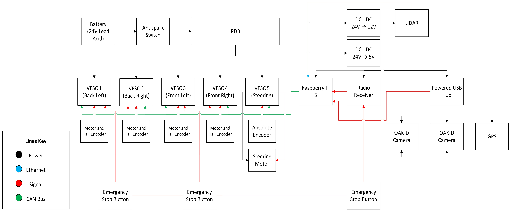

# System Schematic (Version 1)

## Overview
This diagram represents the initial system architecture before simplification.

---

## Interactive Version
🔗 [Open Editable Schematic (SharePoint)](https://ucsdcloud-my.sharepoint.com/:u:/r/personal/kebraun_ucsd_edu/_layouts/15/Doc.aspx?sourcedoc=%7B62cc6a91-ea65-4ae0-8744-ae74101ba50d%7D&action=edit&wdIsModeSwitch=1&or=PrevEdit)

---

## Static View

