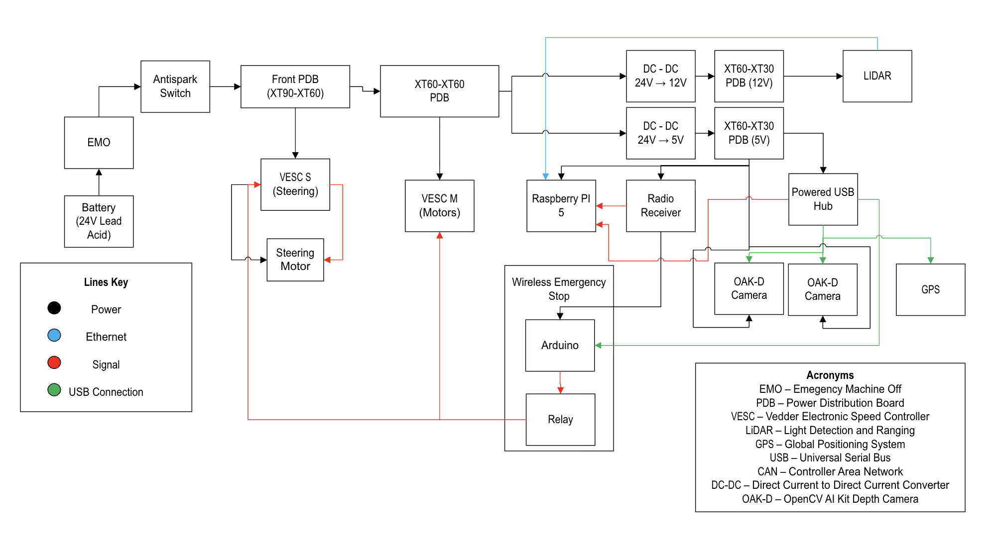

# System Schematic

## Overview
This diagram represents the full system architecture, including power, control, actuation, and sensors.

---

## Interactive Version
🔗[Open Editable Schematic (SharePoint)](https://ucsdcloud-my.sharepoint.com/:u:/r/personal/hrubim_ucsd_edu/Documents/Drawing.vsdx?d=w81e67db119fb4aa7b147fdf2fc1e4224&csf=1&web=1&e=U7m3HO)

---

## Static View

